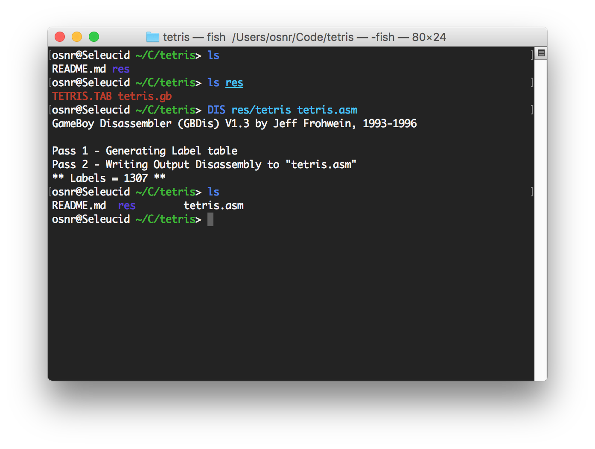

# tetris

Disassembly of the original Tetris for Game Boy. See [tetris.asm](tetris.asm).

It doesn't build yet -- the GBDis assembly syntax is not quite the
same as RGBDS's, which is the standard today (used in pokered, for
instance).

You might be able to build it with some ancient 90s assembler on Jeff
Frohwein's site or something, but so far I've only used it to see
what's going on in Tetris, not to mod it, so I haven't tried.

## Origin

This disassembly is basically Jeff Frohwein's; all I've done is
regenerate it and put it online with instructions.

`res/TETRIS.TAB` is
[Jeff Frohwein's original table](http://www.devrs.com/gb/files/doxs.html)
from June 8, 1996. I used it to generate the initial disassembly from
the Tetris ROM with MD5 `982ed5d2b12a0377eb14bcdc4123744e`.

### Generating tetris.asm from the table file

Get the `tetris.gb` ROM somewhere and put it alongside `TETRIS.TAB` in
the `res` folder.

[Download GBDis V1.3](http://www.devrs.com/gb/files/software.html)
(gbdis13.zip) from Jeff Frohwein's site. It's a DOS binary, but it
comes with its Turbo Pascal source code in a file called
`DIS.PAS`. Here's the header at the top:

```
{   Nintendo Gameboy Disassembler V1.3  }
{              by                       }
{         Jeff Frohwein                 }
{   Written in Turbo Pascal V6.0        }
{   Started: 25 Nov 93                  }
{   Last edited: 9 Jun 96               }
```

Kind of hard to get Turbo Pascal these days, but it turns out you can
get the Free Pascal Compiler -- on macOS, `brew install fpc` -- and
it's _completely compatible_ with Turbo Pascal from 20+ years ago.

Then I just did `MACOSX_DEPLOYMENT_TARGET=10.12 fpc DIS.PAS`
([had to get around some weird bug with FPC and Sierra](https://medium.com/@kviat/free-pascal-3-0-2-linking-on-macos-sierra-c40706e86fda))
and got a Mac binary `DIS`.

```bash
$ unzip gbdis13.zip -d gbdis13
Archive:  gbdis13.zip
  inflating: gbdis13/GBDIS.EXE       
  inflating: gbdis13/GBDIS.TXT       
  inflating: gbdis13/DIS.PAS         
$ cd gbdis13
$ ls
DIS.PAS   GBDIS.EXE GBDIS.TXT
$ MACOSX_DEPLOYMENT_TARGET=10.12 fpc DIS.PAS
Free Pascal Compiler version 3.0.2 [2017/03/18] for x86_64
Copyright (c) 1993-2017 by Florian Klaempfl and others
Target OS: Darwin for x86_64
Compiling DIS.PAS
DIS.PAS(103,28) Warning: Local variable "z" does not seem to be initialized
DIS.PAS(129,6) Note: Local variable "b" not used
DIS.PAS(129,8) Note: Local variable "c" not used
DIS.PAS(290,6) Note: Local variable "a" not used
DIS.PAS(312,21) Warning: Comparison might be always true due to range of constant and expression
DIS.PAS(310,6) Note: Local variable "a" not used
DIS.PAS(27,6) Note: Local variable "count" is assigned but never used
DIS.PAS(27,39) Note: Local variable "pair" not used
DIS.PAS(28,2) Note: Local variable "cp" is assigned but never used
DIS.PAS(28,5) Note: Local variable "pc" not used
DIS.PAS(28,39) Note: Local variable "z" not used
Assembling (pipe) DIS.s
Linking DIS
[... a bunch of warnings ...]
1230 lines compiled, 0.2 sec
2 warning(s) issued
9 note(s) issued
```

Finally, I ran `DIS res/tetris tetris.asm` in this repo, which uses
`tetris.gb` and `tetris.tab` to make the disassembly `tetris.asm`.



Twenty-year-old software, and it works out of the box!

From now on, however, we should probably just edit `tetris.asm`
directly, like in [pokered](https://github.com/iimarckus/pokered) et
al, so this section is for historical interest only.
